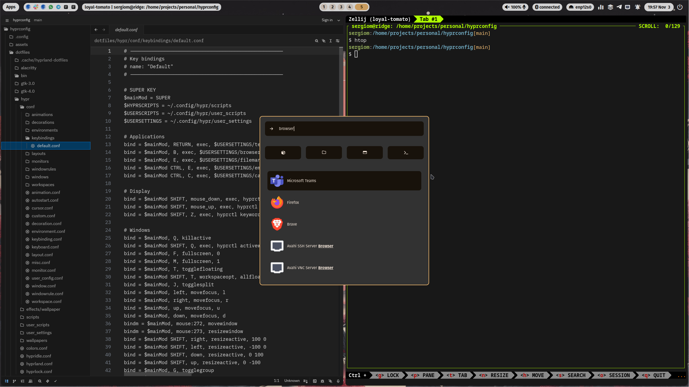

# Hyprland Dotfiles

This repository contains a comprehensive set of personal dotfiles for the Hyprland Wayland compositor. It is designed to provide a modern, functional, and aesthetically pleasing desktop experience that is both highly customizable and easy to manage.

## Features

- **Modular Configuration**: The Hyprland setup is broken down into modular files for easy management of settings, keybindings, and more.
- **Extensive Scripting**: A wide range of scripts are included for automation, system management, and user convenience.
- **Dynamic Theming**: Utilizes `matugen` for dynamic theme generation from wallpapers.
- **Complete Desktop Environment**: Includes configurations for a status bar (Waybar), application launcher (rofi), notification daemon (SwayNC), and more.
- **Developer-Focused**: Comes with pre-configured settings for Neovim (LazyVim), Zed, Zellij, and other development tools.

## Screenshots




## Dotfile Structure

The dotfiles are organized into the following structure within the `dotfiles/` directory:

- **`hypr/`**: Hyprland configuration, including modular `conf/` files, `scripts/`, and `user_scripts/`.
- **`nvim/`**: Neovim configuration with LazyVim.
- **`zellij/`**: Zellij terminal multiplexer configuration.
- **`starship/`**: Starship cross-shell prompt configuration.
- **`alacritty/`**: Alacritty terminal emulator configuration.
- **`rofi/`**: rofi application launcher configuration.
- **`waybar/`**: Waybar status bar configuration.
- **`swaync/`**: SwayNC notification daemon configuration.
- **`wlogout/`**: Wlogout power menu configuration.
- **`gtk-3.0/` & `gtk-4.0/`**: GTK3 and GTK4 theme and application settings.
- **`qt6ct/`**: Qt6 application theming configuration.
- **`matugen/`**: Matugen dynamic theming tool configuration.
- **`lazygit/`**: Lazygit TUI client for Git.
- **`zed/`**: Zed editor configuration.

## Dependencies

This setup relies on a number of tools and packages to function correctly. Key dependencies include:

- **Dotfile Management**: `stow`, `gum`
- **Hyprland Ecosystem**: `hyprland`, `hypridle`, `hyprlock`, `hyprpaper`, `xdg-desktop-portal-hyprland`
- **Core Utilities**: `alacritty`, `rofi`, `waybar`, `swaync`, `wlogout`
- **System Tools**: `pamixer`, `brightnessctl`, `playerctl`, `cliphist`, `jq`, `eza`
- **Theming**: `nwg-look`, `qt6ct`, `matugen`
- **Development**: `neovim`, `lazygit`, `zed`, `zellij`, `starship`

For a complete list, refer to the `install_dependencies.sh` script.

## Installation

1.  **Clone the Repository**:
    ```bash
    git clone https://github.com/highercomve/hyprdotfiles.git ~/.dotfiles
    ```

2.  **Personalize (Optional)**:
    If you plan to use this as your own starting point, you can remove the original Git history:
    ```bash
    cd ~/.dotfiles
    rm -rf .git
    ```

3.  **Install Dependencies**:
    Run the provided script to install all necessary packages.
    ```bash
    ./install_dependencies.sh
    ```

4.  **Deploy Dotfiles**:
    This project uses GNU Stow to symlink the dotfiles into place. The `apply.sh` script will handle this for you.
    ```bash
    ./apply.sh
    ```

5.  **Set Default Applications (Optional)**:
    Run the script to automatically detect and set your default applications.
    ```bash
    ./set_default.sh
    ```

## Configuration

The Hyprland configuration is highly modular, with the main `hyprland.conf` file sourcing smaller, more specific files from the `~/.config/hypr/conf/` directory. This allows for easier customization and maintenance.

Key configuration files include:
- `monitor.conf`: Monitor setup and resolutions.
- `keybinding.conf`: All keyboard shortcuts.
- `autostart.conf`: Applications and services to launch at startup.
- `window.conf`: General window behavior and rules.
- `decoration.conf`: Window decorations, shadows, and blur effects.
- `animation.conf`: Animations for windows and workspaces.
- `user_config.conf`: For user-specific overrides.

## Scripts

This repository includes a wide variety of scripts to extend functionality:

- **`hypr/scripts/`**: Core scripts for managing wallpapers, power settings, screenshots, and more.
- **`hypr/user_scripts/`**: User-specific scripts for things like event listeners, update notifications, and theme switching.
- **`hypr/user_settings/`**: A directory for storing user preferences that can be sourced by various scripts.
- **`set_default.sh`**: This script automatically detects and sets default applications (like browser, file manager, terminal, etc.) based on what's installed on your system. It updates the relevant files in `hypr/user_settings/`.

All shell scripts are linted with `shellcheck` to ensure quality and correctness.

## Theming

Theming is managed through a combination of tools:
- **`matugen`**: Dynamically generates color schemes from the current wallpaper.
- **`nwg-look`**: A GUI tool for setting GTK themes and icons.
- **`qt6ct`**: For applying themes to Qt-based applications.
- **Custom Scripts**: Scripts are used to apply themes to Waybar, rofi, and other components.

## TODO

- add support to themes
- add theme switcher rofi interface
