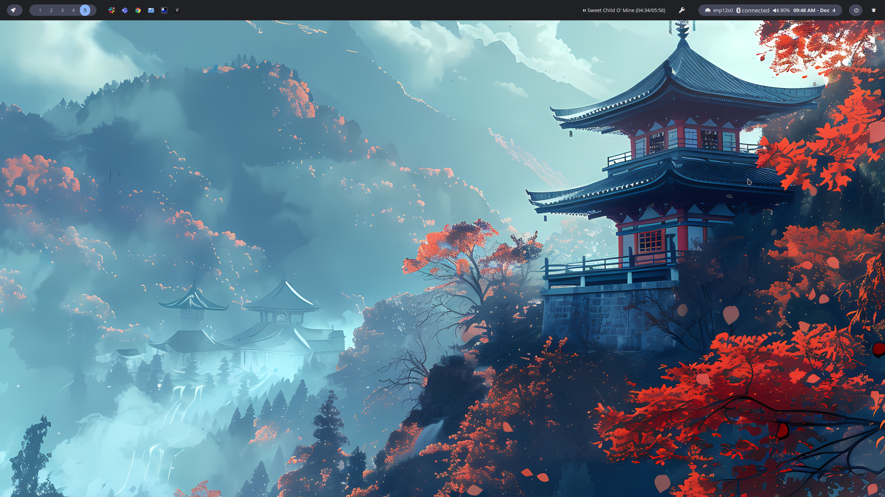
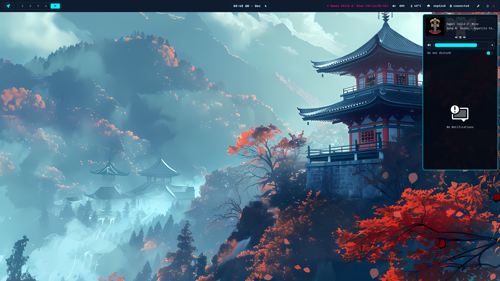
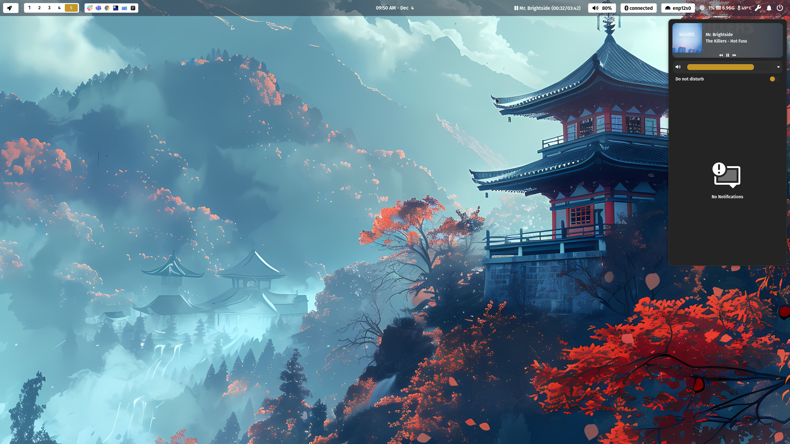
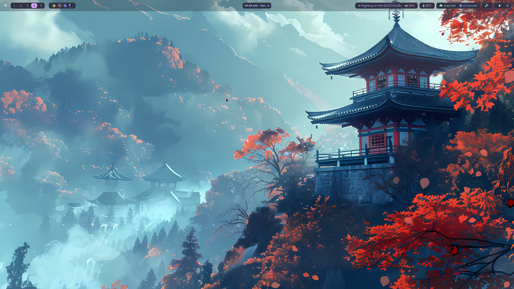
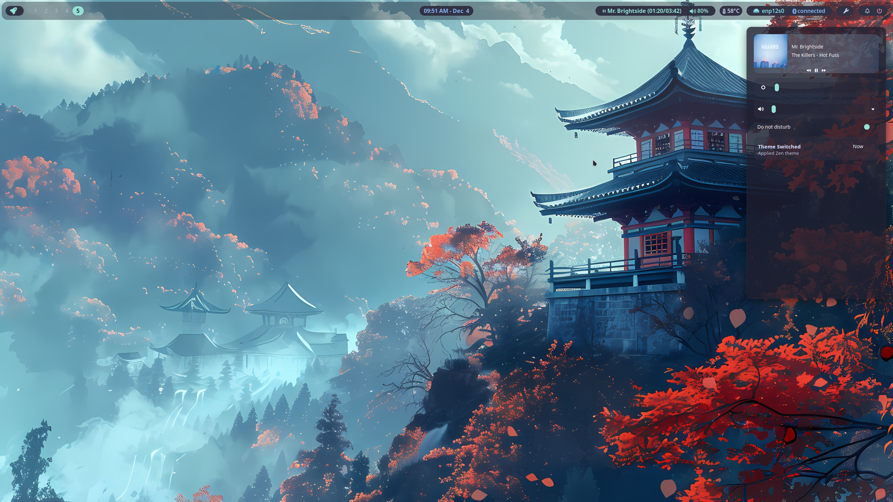
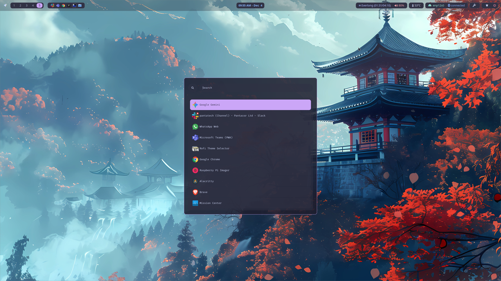
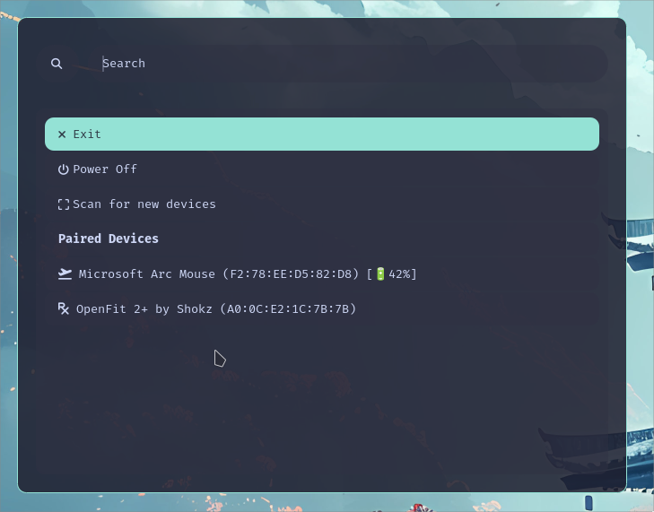
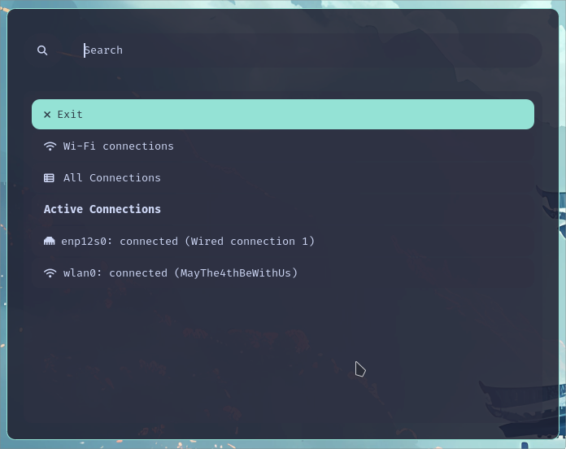
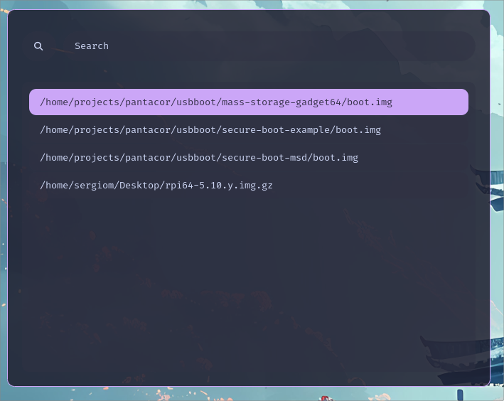

# Hyprland Dotfiles

This repository contains a comprehensive set of personal dotfiles for the Hyprland Wayland compositor. It is designed to provide a modern, functional, and aesthetically pleasing desktop experience that is both highly customizable and easy to manage.

## Features

- **Modular Configuration**: The Hyprland setup is broken down into modular files for easy management of settings, keybindings, and more.
- **Rofi-based System Management**:
  - **Bluetooth Manager**: A full-featured Rofi-based UI (`rofi-bluetooth.sh`) to scan, pair, connect, and manage Bluetooth devices.
  - **Network Manager**: A powerful Rofi-based UI (`rofi-network-manager.sh`) for managing network connections, scanning Wi-Fi, and viewing connection details.
    [](https://youtu.be/xUOHHbTmlFE)
- **Screen Recording**: A simple script (`record.sh`) to start, stop, and toggle screen recording with `wf-recorder`, including status integration for Waybar.
- **Extensive Scripting**: A wide range of scripts are included for automation, system management, and user convenience.
- **Dynamic Theming**: Utilizes `matugen` for dynamic theme generation from wallpapers.
- **Complete Desktop Environment**: Includes configurations for a status bar (Waybar), application launcher (rofi), notification daemon (SwayNC), and more.
- **Developer-Focused**: Comes with pre-configured settings for Neovim (LazyVim), Zed, Zellij, and other development tools.

## Screenshots

### Themes

| ChromeOS | Future |
| :---: | :---: |
|  |  |

| Light | Modern |
| :---: | :---: |
|  |  |

| Zen | |
| :---: | :---: |
|  | |

### Functionality

| App Launcher | Bluetooth Manager |
| :---: | :---: |
|  |  |

| Network Manager | Image Flasher |
| :---: | :---: |
|  |  |

## Dotfile Structure

The dotfiles are organized into the following structure within the `dotfiles/` directory:

- **`hypr/`**: Hyprland configuration, including modular `conf/` files, and `scripts/`.
- **`nvim/`**: Neovim configuration with LazyVim.
- **`zellij/`**: Zellij terminal multiplexer configuration.
- **`starship/`**: Starship cross-shell prompt configuration.
- **`alacritty/`**: Alacritty terminal emulator configuration.
- **`rofi/`**: rofi application launcher configuration.
- **`waybar/`**: Waybar status bar configuration.
- **`swaync/`**: SwayNC notification daemon configuration.
- **`wlogout/`**: Wlogout power menu configuration.
- **`gtk-3.0/` & `gtk-4.0/`**: GTK3 and GTK4 theme and application settings.
- **`qt6ct/`**: Qt6 application theming configuration.
- **`matugen/`**: Matugen dynamic theming tool configuration.
- **`lazygit/`**: Lazygit TUI client for Git.
- **`zed/`**: Zed editor configuration.

## Dependencies

This setup relies on a number of tools and packages to function correctly. Key dependencies include:

- **Dotfile Management**: `stow`, `gum`
- **Hyprland Ecosystem**: `hyprland`, `hypridle`, `hyprlock`, `hyprpaper`, `xdg-desktop-portal-hyprland`
- **Core Utilities**: `alacritty`, `rofi`, `waybar`, `swaync`, `wlogout`
- **System Tools**: `pamixer`, `brightnessctl`, `playerctl`, `cliphist`, `jq`, `eza`
- **Theming**: `nwg-look`, `qt6ct`, `matugen`
- **Development**: `neovim`, `lazygit`, `zed`, `zellij`, `starship`

For a complete list, refer to the `install_dependencies.sh` script.

## Installation

1.  **Clone the Repository**:
    ```bash
    git clone https://github.com/highercomve/hyprdotfiles.git ~/.dotfiles
    ```

2.  **Personalize (Optional)**:
    If you plan to use this as your own starting point, you can remove the original Git history:
    ```bash
    cd ~/.dotfiles
    rm -rf .git
    ```

3.  **Install Dependencies**:
    Run the provided script to install all necessary packages.
    ```bash
    ./install_dependencies.sh
    ```

4.  **Deploy Dotfiles**:
    This project uses GNU Stow to symlink the dotfiles into place. The `apply.sh` script will handle this for you.
    ```bash
    ./apply.sh
    ```

5.  **Set Default Applications (Optional)**:
    Run the script to automatically detect and set your default applications.
    ```bash
    ./set_default.sh
    ```

## Configuration

The Hyprland configuration is highly modular, with the main `hyprland.conf` file sourcing smaller, more specific files from the `~/.config/hypr/conf/` directory. This allows for easier customization and maintenance.

Key configuration files include:
- `monitor.conf`: Monitor setup and resolutions.
- `keybinding.conf`: All keyboard shortcuts.
- `autostart.conf`: Applications and services to launch at startup.
- `window.conf`: General window behavior and rules.
- `decoration.conf`: Window decorations, shadows, and blur effects.
- `animation.conf`: Animations for windows and workspaces.
- `user_config.conf`: For user-specific overrides.

## Scripts

This repository includes a wide variety of scripts to extend functionality:

- **`hypr/scripts/`**: Core scripts for managing wallpapers, power settings, screenshots, and more.
- **`hypr/scripts/`**: User-specific scripts for things like event listeners, update notifications, and theme switching.
- **`hypr/user_settings/`**: A directory for storing user preferences that can be sourced by various scripts.
- **`set_default.sh`**: This script automatically detects and sets default applications (like browser, file manager, terminal, etc.) based on what's installed on your system. It updates the relevant files in `hypr/user_settings/`.

Many of these scripts, especially the interactive utilities, are designed to be launched with hotkeys defined in `hypr/conf/keybinding.conf`. You can view all configured keybindings by running the `hypr/scripts/keybindings.sh` script (bound to `Super + Ctrl + K`), which displays them in a convenient Rofi menu.

All shell scripts are linted with `shellcheck` to ensure quality and correctness.

### Featured Scripts

#### `disks.sh`

A utility to manage disk devices, which is bound to `Super + D`. It allows you to select a disk, and then choose to either copy its device path or format it.

**Video demonstration:** [https://youtu.be/jM4sE7jS1Xk](https://youtu.be/jM4sE7jS1Xk)

**Features**

- Lists all available physical disk devices.
- Interactive selection using `rofi`.
- Actions available:
    - **Copy path**: Copies the device path (e.g., `/dev/sda`) to the clipboard.
    - **Format disk**: Opens a new terminal to format the selected disk. This action requires `sudo` privileges.

#### `ttyusb.sh`

A utility for managing `ttyUSB` serial devices, which is bound to `Super + Shift + D`. It allows you to select a device and then choose to either copy its path or open a serial console.

**Video demonstration:** [https://youtu.be/SoM7voD3kRk](https://youtu.be/SoM7voD3kRk)

**Features**

- Lists all connected `ttyUSB` devices with descriptive names (vendor, model, serial).
- Interactive selection using `rofi`.
- Actions available:
    - **Copy path**: Copies the device path (e.g., `/dev/ttyUSB0`) to the clipboard.
    - **Open console**: Opens a new terminal with a `picocom` serial console connected to the selected device.
    - **Set custom name / Set baud**: Per-device name and console baud rate (e.g. `921600` for the Orange Pi i96), stored in `~/.config/hypr/user_settings/ttyusb-aliases.conf`.

## Theming

The system features a robust theming engine that allows you to switch between different visual styles instantly.

**Theme Switcher**:
A unified theme switcher script (`themes/themeswitcher.sh`) is included to toggle between configurations for:
- **Waybar**: Status bar styles.
- **SwayNC**: Notification center styling.
- **Rofi**: Application launcher and menu themes.
- **Wlogout**: Power menu layouts.
- **Waypaper**: Wallpaper management.

**Supported Themes**:
- **Default**: The standard look.
- **ChromeOS**: A clean, ChromeOS-inspired interface.
- **Light**: A bright, legible theme.
- **Modern**: A sleek, contemporary dark theme.
- **Future**: A futuristic, high-contrast style.
- **Zen**: A minimal, distraction-free layout.

Theming is further enhanced by:
- **`matugen`**: Dynamically generates color schemes from the current wallpaper.
- **`nwg-look`**: A GUI tool for setting GTK themes and icons.
- **`qt6ct`**: For applying themes to Qt-based applications.

## TODO

- [x] add support to themes
- [x] add theme switcher rofi interface
